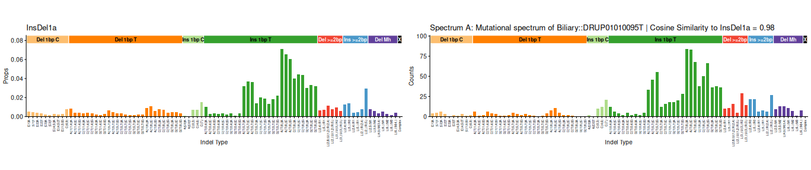
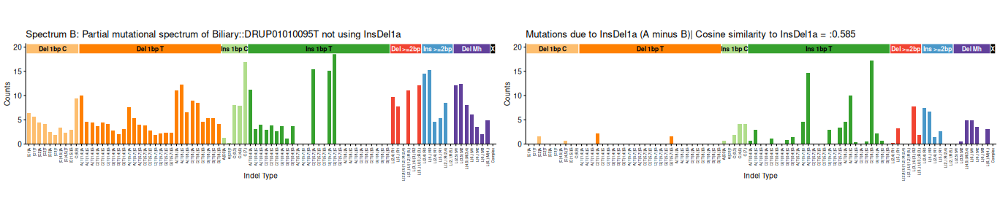
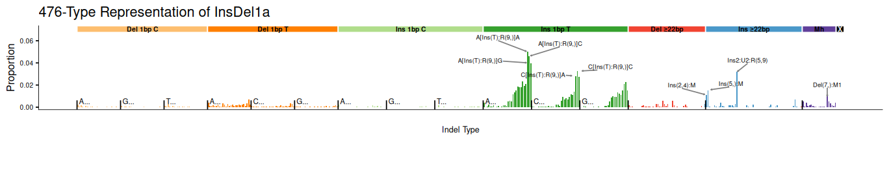

``` r
data_dir = "../Manuscript_data/"
plot476_base_size = 18
plto476_simplify_labels = FALSE
plot476_height = unit(4, "in")
plot89_height = unit(3, "in")

print(getwd())
```

```
## [1] "/home/steve/github/Code_Liu_2025/vignette"
```


``` r
ID89_ID83_connection_example <- fread(file.path(
  data_dir,
  "89type_to_83type_connection.tsv"
))
colnames(ID89_ID83_connection_example) <- c(
  "ID89_signature",
  "example_catalog",
  "ID83_signature",
  "type746_signature_id",
  "type476_where_extracted"
)


to.plot.WGS_PCAWG_HMF_indels.catalog <- fread(file.path(
  data_dir,
  "Liu_et_al_83_type_spectra.tsv"
)) # "justified.HMF.PCAWG.COSMIC83catalog.txt")

to.plot.WGS_PCAWG_HMF_indels.catalog <- ICAMS::as.catalog(
  to.plot.WGS_PCAWG_HMF_indels.catalog[, -1],
  infer.rownames = T
)
to.plot.WGS_PCAWG_HMF_indels.catalog.no.polyT <- to.plot.WGS_PCAWG_HMF_indels.catalog
to.plot.WGS_PCAWG_HMF_indels.catalog.no.polyT[c(12, 24), ] <- 0
```


``` r
final.Koh476.signatures <- as.data.frame(data.table::fread(
  file.path(
    data_dir,
    "Liu_et_al_final_476_type_signatures.tsv"
  )
))
row.names(final.Koh476.signatures) <- final.Koh476.signatures[, 1] # Use the first column as row names

# Optionally, remove the first column from the data table
final.Koh476.signatures <- final.Koh476.signatures[, -1]

to.plot.all.ID476.catalogs <- as.data.frame(data.table::fread(
  file.path(data_dir, "Liu_et_al_476_type_spectra.tsv")
))
row.names(to.plot.all.ID476.catalogs) <- to.plot.all.ID476.catalogs[, 1] # Use the first column as row names

# Optionally, remove the first column from the data table
to.plot.all.ID476.catalogs <- to.plot.all.ID476.catalogs[, -1]
```


### InsDel1a


### InsDel1a 

  83-Type Signature: C_ID1 

  Supporting spectrum: Biliary::DRUP01010095T



 Cosine similarity of 476-Type Signature vs Examplar: 0.96



```
## Error:
## ! object 'p6' not found
```


